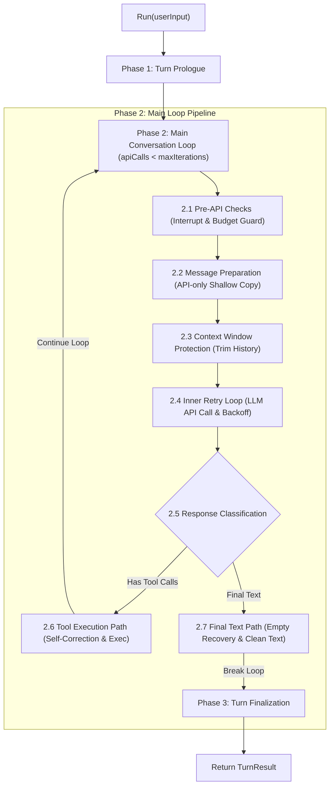

# Abstract Agent Conversation Loop Workflow

> **Repository:** [ai-agent-platform-design](file:///c:/Users/hwang5/wiki/projects/ai-agent-platform-design)  
> **Source Model:** Hermes Agent `run_conversation` architecture ([conversation_loop.py](file:///c:/Users/hwang5/wiki/raw/projects/hermes-agent/agent/conversation_loop.py))

---

## 1. Overview & Architecture

The **Agent Conversation Loop** drives a single user turn through a structured 4-phase state machine. It handles multi-turn LLM reasoning, self-correcting tool call execution, context window protection, transient error retries, and empty response recovery.

---

## 2. The 4 Phases

### Phase 1: Turn Prologue (Initialization & Configuration)
- **Input:** User message string + canonical conversation history.
- **Actions:**
  1. Append the user message to canonical `MessageHistory`.
  2. Reset per-turn counters: `api_call_count = 0`, `empty_content_retries = 0`, `interrupt_requested = false`.
  3. Ensure System Prompt identity is active at index 0 of `MessageHistory`.

### Phase 2: Main Conversation Loop (`while api_call_count < max_iterations`)

#### Step 2.1: Pre-API Checks
- Check `interrupt_requested`. If true, set `exit_reason = "interrupted"` and break loop.
- Check iteration budget (`api_call_count < max_iterations`). If exhausted, set `exit_reason = "budget_exhausted"` and break loop.
- Increment `api_call_count`.

#### Step 2.2: Message Preparation (`api_messages`)
- Shallow copy canonical messages into `api_messages` for the API payload.
- Ensures transient/ephemeral injections (e.g. environment hints, steering markers) do not pollute canonical stored history.

#### Step 2.3: Context Window Protection
- Evaluate request size / message count against `context_window_limit` (e.g., 30 messages).
- If exceeded, trim middle history while preserving System Prompt (index 0), initial User prompt, and recent N messages.
- Inject a system summary notification into `api_messages`.

#### Step 2.4: Inner API Retry Loop
- Invoke LLM API with up to `max_retries` (default: 3).
- Catch network/API exceptions and apply exponential backoff.

#### Step 2.5: Response Classification
- Extract `content` and `tool_calls` from response message.

#### Step 2.6: Tool Execution Path (if `tool_calls` present)
1. **Unregistered Tool Self-Correction:** If tool is unknown, append synthetic tool result `"Error: Tool '[name]' is not registered. Available tools: [...]"`, allowing LLM to self-correct in next iteration.
2. **JSON Arguments Validation:** If JSON parsing fails, append synthetic tool error message.
3. **Runtime Exception Handling:** Catch tool execution exceptions and format error string as tool result.
4. Append assistant message (`tool_calls`) and tool result messages (`role="tool"`) to canonical `MessageHistory`.
5. `continue` loop to process tool outputs.

#### Step 2.7: Final Text Response Path (if no `tool_calls`)
1. **Empty Response Recovery:** If response text is empty, retry up to 2 times with a prompt nudge. If still empty, supply fallback text `"(empty response)"`.
2. Append final assistant text message to `MessageHistory`.
3. Set `completed = true`, `exit_reason = "text_response"`.
4. `break` loop.

### Phase 3: Turn Finalization
- Assemble and return canonical `TurnResult` object:
  - `final_response`: Assistant text answer.
  - `messages`: Full updated canonical history.
  - `api_calls`: Total LLM calls performed.
  - `completed`: Boolean indicating clean completion.
  - `failed`: Boolean indicating failure.
  - `interrupted`: Boolean indicating user cancellation.
  - `exit_reason`: Standard exit string (`"text_response"`, `"budget_exhausted"`, `"api_error"`, `"interrupted"`).
  - `error`: Diagnostic error message if failed.

---

## 3. Implementation Matrix Across Languages

| Language | Directory | Key Component / Pattern |
|---|---|---|
| **Python** | `implementations/python/` | Dataclass `TurnResult`, OOP `Agent` loop |
| **TypeScript** | `implementations/typescript/` | Interface `TurnResult`, async `Agent` class |
| **C#** | `implementations/csharp/` | `TurnResult` class, Azure OpenAI SDK `Agent` |
| **Go** | `implementations/go/` | `TurnResult` struct, `context.Context` `Agent` |
| **F#** | `implementations/fsharp/` | Discriminated Unions, Records & Forward Piping (`\|>`) |
