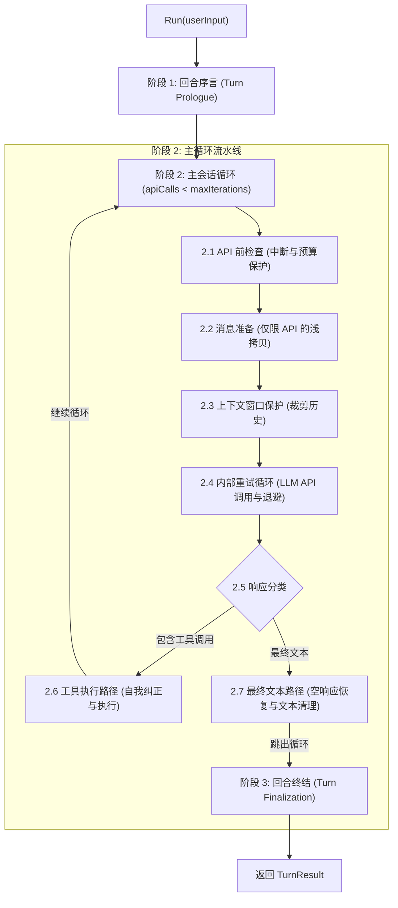

# 抽象 Agent 会话循环工作流 (Conversation Loop Workflow)

> **代码库：** [ai-agent-platform-design](file:///c:/Users/hwang5/wiki/projects/ai-agent-platform-design)  
> **来源模型：** Hermes Agent `run_conversation` 架构 ([conversation_loop.py](file:///c:/Users/hwang5/wiki/raw/projects/hermes-agent/agent/conversation_loop.py))

---

## 1. 概述与架构

**Agent 会话循环（Agent Conversation Loop）** 通过一个结构化的 4 阶段状态机驱动单个用户回合（Turn）。它负责处理 LLM 多轮推理、自我纠正的工具调用执行、上下文窗口保护、瞬态错误重试以及空响应恢复。

---

## 2. 四个阶段详解

### 阶段 1：回合序言 (Turn Prologue - 初始化与配置)
- **输入：** 用户消息字符串 + 规范化会话历史（`MessageHistory`）。
- **操作：**
  1. 将用户消息追加到规范化 `MessageHistory` 中。
  2. 重置每回合计数器：`api_call_count = 0`、`empty_content_retries = 0`、`interrupt_requested = false`。
  3. 确保系统提示词（System Prompt）身份在 `MessageHistory` 索引 0 处处于激活状态。

### 阶段 2：主会话循环 (`while api_call_count < max_iterations`)

#### 步骤 2.1：API 前检查
- 检查 `interrupt_requested`。若为 true，设置 `exit_reason = "interrupted"` 并跳出循环。
- 检查迭代预算（`api_call_count < max_iterations`）。若耗尽，设置 `exit_reason = "budget_exhausted"` 并跳出循环。
- 递增 `api_call_count`。

#### 步骤 2.2：消息准备 (`api_messages`)
- 将规范化消息浅拷贝到 `api_messages` 中作为 API 请求载荷。
- 确保临时/瞬态注入（例如环境提示、引导标记）不会污染规范化的存储历史。

#### 步骤 2.3：上下文窗口保护
- 对照 `context_window_limit`（例如 30 条消息）评估请求大小/消息数量。
- 若超出限制，裁剪中间历史，同时保留系统提示词（索引 0）、初始用户提示词以及最近的 N 条消息。
- 在 `api_messages` 中注入系统摘要通知。

#### 步骤 2.4：内部 API 重试循环
- 调用 LLM API，最多重试 `max_retries` 次（默认：3 次）。
- 捕获网络/API 异常并应用指数退避（Exponential Backoff）。

#### 步骤 2.5：响应分类
- 从响应消息中提取 `content` 和 `tool_calls`。

#### 步骤 2.6：工具执行路径（若存在 `tool_calls`）
1. **未注册工具自我纠正：** 若工具未知，追加合成工具错误结果 `"Error: Tool '[name]' is not registered. Available tools: [...]"`，允许 LLM 在下一次迭代中自我纠正。
2. **JSON 参数验证：** 若 JSON 解析失败，追加合成工具错误消息。
3. **运行时异常处理：** 捕获工具执行异常并将错误字符串格式化为工具结果。
4. 将助手消息（`tool_calls`）和工具结果消息（`role="tool"`）追加到规范化 `MessageHistory` 中。
5. `continue` 循环以处理工具输出。

#### 步骤 2.7：最终文本响应路径（若无 `tool_calls`）
1. **空响应恢复：** 若响应文本为空，使用提示词推动（Prompt Nudge）最多重试 2 次。若仍为空，提供后备文本 `"(empty response)"`。
2. 将最终助手文本消息追加到 `MessageHistory` 中。
3. 设置 `completed = true`、`exit_reason = "text_response"`。
4. `break` 跳出循环。

### 阶段 3：回合终结 (Turn Finalization)
- 组装并返回规范化 `TurnResult` 对象：
  - `final_response`：助手文本回答。
  - `messages`：完整更新后的规范化历史。
  - `api_calls`：执行的 LLM 调用总数。
  - `completed`：表示干净完成的布尔标志。
  - `failed`：表示失败的布尔标志。
  - `interrupted`：表示用户取消的布尔标志。
  - `exit_reason`：标准退出原因字符串（`"text_response"`、`"budget_exhausted"`、`"api_error"`、`"interrupted"`）。
  - `error`：失败时的诊断错误消息。

---

## 3. 多语言实现对照表

| 语言 | 目录 | 核心组件 / 模式 |
|---|---|---|
| **Python** | `implementations/python/` | Dataclass `TurnResult`，面向对象 `Agent` 循环 |
| **TypeScript** | `implementations/typescript/` | Interface `TurnResult`，异步 `Agent` 类 |
| **C#** | `implementations/csharp/` | `TurnResult` 类，Azure OpenAI SDK `Agent` |
| **Go** | `implementations/go/` | `TurnResult` 结构体，`context.Context` `Agent` |
| **F#** | `implementations/fsharp/` | 可区分联合 (Discriminated Unions)、记录类型 & 前向管道 (`\|>`) |
