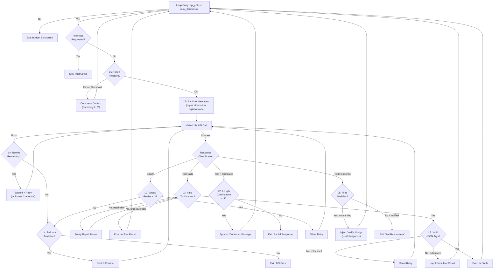

# Agent Iteration Loop — Design Purpose & Architecture

> **Last Updated:** 2026-08-03  
> **Related:** [HERMES_LOOP_CONDITIONS.md](file:///c:/Users/hwang5/wiki/projects/ai-agent-platform-design/docs/HERMES_LOOP_CONDITIONS.md) — Source-level analysis of all 37 loop conditions  
> **Related:** [CONVERSATION_LOOP_WORKFLOW.md](file:///c:/Users/hwang5/wiki/projects/ai-agent-platform-design/docs/CONVERSATION_LOOP_WORKFLOW.md) — Abstract 4-phase workflow specification

---

## 1. Core Design Intent

The iteration loop exists because **LLM API calls are fundamentally unreliable** — they can fail, truncate, hallucinate, or produce empty output at any moment. The loop's purpose is to **maximize the probability of producing a useful final response** from an inherently non-deterministic system.

The loop is **not** a simple `while (has_tool_calls)` — it is a **resilience state machine** with 5 concentric defense layers, each handling a distinct failure class.

---

## 2. Five-Layer Resilience Architecture

```
┌─────────────────────────────────────────────────────────┐
│                    Layer 5: Quality Gates                │
│              (compress, verify, sanitize)                │
│  ┌───────────────────────────────────────────────────┐  │
│  │           Layer 4: Provider Failover              │  │
│  │         (rate limit, auth, content filter)        │  │
│  │  ┌─────────────────────────────────────────────┐  │  │
│  │  │       Layer 3: Self-Correction              │  │  │
│  │  │    (invalid tools, bad JSON, intent ack)    │  │  │
│  │  │  ┌───────────────────────────────────────┐  │  │  │
│  │  │  │    Layer 2: Output Recovery           │  │  │  │
│  │  │  │  (truncation, empty, continuation)    │  │  │  │
│  │  │  │  ┌─────────────────────────────────┐  │  │  │  │
│  │  │  │  │  Layer 1: Core Agent Loop       │  │  │  │  │
│  │  │  │  │  (tool call → result → respond) │  │  │  │  │
│  │  │  │  └─────────────────────────────────┘  │  │  │  │
│  │  │  └───────────────────────────────────────┘  │  │  │
│  │  └─────────────────────────────────────────────┘  │  │
│  └───────────────────────────────────────────────────┘  │
└─────────────────────────────────────────────────────────┘
```

Each layer wraps the layer beneath it. A request flows inward from Layer 5 to Layer 1, and failures propagate outward — Layer 1 failures are caught by Layer 2, Layer 2 failures by Layer 3, etc.

---

### Layer 1: Core Agent Loop (The Happy Path)

> **Purpose:** Enable multi-step reasoning where the LLM uses tools iteratively until it has enough information to answer.

```
User → LLM → ToolCall? ─Yes─→ Execute Tools → Inject Results ─┐
                │                                                │
                No                                               │
                │                                                │
           TextResponse → Exit                         (loop back to LLM)
```

This is the **ReAct (Reasoning + Acting) pattern** — the fundamental agentic loop. The LLM reasons about what tool to call, observes the result, then either calls another tool or produces a final text response.

**Key Design Decisions:**
- The loop condition is `api_call_count < max_iterations` — a hard ceiling preventing runaway tool loops
- Each iteration appends the tool result as a `role: "tool"` message, maintaining the full conversation context
- The loop exits only when the LLM produces a text response (no tool calls) or hits the iteration limit

**What we implemented:** ✅ Fully covered in all 5 language implementations.

---

### Layer 2: Output Recovery

> **Purpose:** LLMs have hard output token limits. A single API call often isn't enough. This layer stitches partial outputs together and recovers from silent failures.

| Failure Mode | Recovery Strategy | Max Retries |
|---|---|:---:|
| `finish_reason="length"` (text truncated) | Append "please continue" user message, loop again | 4 |
| `finish_reason="length"` (tool call JSON truncated) | Retry same API call with progressively larger `max_tokens` | 4 |
| Empty response (no content, no tool calls) | Silent retry — re-send the same request | 3 |
| Thinking budget exhaustion | Detect `<think>` tags with no visible text after → give up with targeted error | 0 (no retry) |

**Design Rationale:**
- **Length continuation** is critical for long responses (code generation, documentation). Without it, the agent silently drops the second half of a file.
- **Empty response silent retry** handles transient model failures without polluting the conversation with nudge messages. Only after 3 silent failures does Hermes escalate (to Layer 4 fallback or "(empty)" terminal).
- **Thinking budget detection** prevents wasting 3 API calls on a model that clearly can't produce visible output.

**What we implemented:** ⚠️ Partial — we handle empty responses with a nudge message (not silent retry), but don't check `finish_reason` at all.

---

### Layer 3: Self-Correction

> **Purpose:** LLMs regularly produce structurally invalid tool calls. Rather than failing the turn, feed the error back so the LLM can self-correct in-context.

| Failure Mode | Recovery Strategy | Max Retries |
|---|---|:---:|
| Hallucinated tool name | Return error tool result listing available tools | 3 |
| Tool name typo | Fuzzy match + auto-repair (e.g., `read_fil` → `read_file`) | Before error |
| Invalid JSON arguments | Phase 1: Silent retry (3x). Phase 2: Inject error tool result | 3 + 1 |
| Intent acknowledgment without action | Inject "please proceed" user message | 1 |

**Design Rationale:**
- **Error-as-tool-result** is the key pattern. By returning the error as a `role: "tool"` message (not a `role: "user"` message), the conversation maintains valid role alternation, and the LLM sees the error in the same context as its own tool call attempt.
- **Fuzzy repair** is tried before returning an error because many models make predictable typos (missing underscore, wrong casing). Auto-repairing avoids wasting an iteration on something deterministically fixable.
- **Two-phase JSON recovery** is important: silent retries handle transient generation issues (model outputting slightly different JSON each time), while the error injection phase handles persistent formatting mistakes.

**What we implemented:** ⚠️ Partial — we do error-as-tool-result for invalid names but lack fuzzy repair, retry caps, and two-phase JSON recovery.

---

### Layer 4: Provider Failover

> **Purpose:** Production agents can't depend on a single API endpoint. This layer implements automatic failover across multiple LLM providers.

| Trigger | Failover Action |
|---|---|
| Rate limit (HTTP 429) | Activate next provider in fallback chain |
| Authentication failure (HTTP 401) | Rotate to next credential in credential pool |
| Billing/quota error | Activate fallback provider |
| Content filter termination | Switch to fallback (filter is content-deterministic) |
| Empty response after 3 retries | Switch to fallback (model may be degraded) |
| Nous Portal rate limit | Check cross-session rate limit state, activate fallback |

**Design Rationale:**
- **Fallback chain** is configured as an ordered list of providers (e.g., `[OpenAI, Anthropic, local_ollama]`). Each failover moves to the next provider and resets retry counters.
- **Content filter failover** is particularly clever: if the provider's safety filter killed the stream, retrying with the *same* provider will deterministically fail again. Switching to a different provider (which may have different filter thresholds) is the only way forward.
- **Credential pool rotation** handles OAuth token expiry in multi-tenant deployments where the agent has multiple credential sets for the same provider.

**What we implemented:** ❌ Not implemented — single provider only.

---

### Layer 5: Quality Gates

> **Purpose:** Ensure response quality and conversation health. These are proactive checks, not reactive error handlers.

| Gate | Purpose | When |
|---|---|---|
| **Token-level context compression** | Conversation too long → summarize with auxiliary LLM before next call | Pre-API call |
| **Message sequence repair** | Fix broken role alternation (user→user, tool orphans) | Pre-API call |
| **Orphan tool result sanitization** | Remove tool results without matching tool calls | Pre-API call |
| **Verification stop gate** | Agent modified files but didn't test → inject "please verify" | Pre-exit |
| **KV cache normalization** | Normalize whitespace/JSON for consistent prefix matching | Pre-API call |

**Design Rationale:**
- **Context compression** is the most impactful gate. Without it, long conversations overflow the context window and either fail (API error) or degrade (model ignores early context). Hermes uses a *separate LLM call* to summarize the conversation history, then replaces the middle of the conversation with the summary — keeping the system prompt and recent messages intact.
- **Verification stop gate** implements a form of **self-review**: if the agent edited code files during the turn, it intercepts the final response and injects a "did you verify your changes?" nudge. The original response is held in `_pending_verification_response` and only emitted after the agent runs tests/builds.
- **Message sequence repair** prevents silent API failures. Many providers return empty responses (not errors) when role alternation is violated, making the root cause invisible without this guard.

**What we implemented:** ❌ Mostly not implemented — we do simple message-count trimming instead of token-level compression, no verification gate, no message repair.

---

## 3. Iteration Flow — Decision Tree



---

## 4. Design Principles Extracted

### 4.1 Fail Inward, Escalate Outward
Each layer handles its own failure class. Only when a layer exhausts its recovery options does it escalate to the next outer layer. This prevents over-reaction (e.g., switching providers for a simple JSON typo).

### 4.2 Error-as-Context, Not Error-as-Exception
Tool errors are returned as `role: "tool"` messages, not thrown as exceptions. This keeps the LLM "in the loop" — it sees its own mistake and can self-correct. This is fundamentally different from traditional error handling.

### 4.3 Silent Recovery Preferred
The first recovery attempt is always silent (no user-visible message). Only after repeated failures does the system emit status messages. This keeps the user experience clean while still being resilient.

### 4.4 Budget as Safety Net
The iteration budget (`max_iterations`, `IterationBudget`, grace call) serves as an absolute safety net. Without it, a pathological tool loop (tool A calls tool B which calls tool A) could run forever. The budget ensures termination regardless of what the LLM does.

### 4.5 Immutable Message History
API payloads are built from a shallow copy of `messages`. The original history is never mutated for API-specific transformations (cache control, whitespace normalization, sanitization). This ensures session persistence and replay fidelity.

---

## 5. Platform Implementation Roadmap

Based on the 5-layer architecture, the recommended implementation order (by impact/complexity ratio):

| Priority | Layer | Feature | Impact | Complexity |
|:---:|---|---|---|---|
| **P0** | L1 | Core agent loop (tool call → result → respond) | Critical | Low |
| **P1** | L2 | `finish_reason="length"` continuation | High | Low |
| **P1** | L3 | Invalid tool name retry cap (3x) | High | Low |
| **P1** | L3 | Two-phase JSON recovery | Medium | Low |
| **P2** | L2 | Empty response silent retry (no nudge) | Medium | Low |
| **P2** | L5 | Token-level context compression | High | High |
| **P2** | L5 | Message sequence repair | Medium | Medium |
| **P3** | L4 | Multi-provider fallback chain | High | High |
| **P3** | L4 | Credential pool rotation | Medium | High |
| **P3** | L5 | Verification stop gate | Medium | Medium |
| **P4** | L3 | Tool name fuzzy repair | Low | Medium |
| **P4** | L4 | Content filter failover | Low | Medium |
| **P4** | L5 | KV cache normalization | Low | Low |

**Current Status:** P0 complete. P1–P4 are the remaining 26 conditions.
