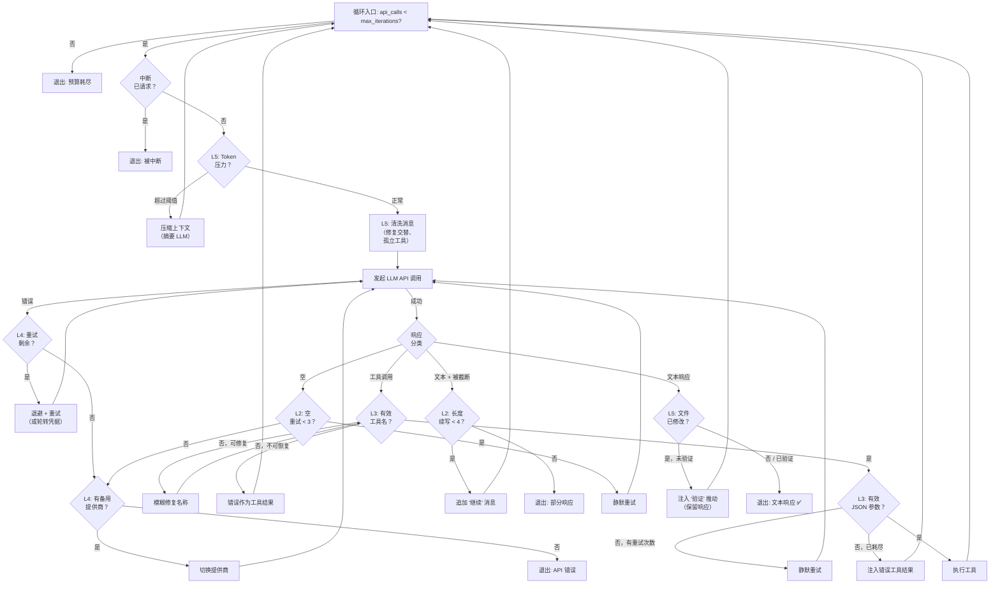

# Agent 迭代循环 — 设计目的与架构

> **最后更新日期：** 2026-08-03  
> **相关文档：** [HERMES_LOOP_CONDITIONS.zh.md](file:///c:/Users/hwang5/wiki/projects/ai-agent-platform-design/docs/HERMES_LOOP_CONDITIONS.zh.md) — 全部 37 个循环条件的源码级分析  
> **相关文档：** [CONVERSATION_LOOP_WORKFLOW.zh.md](file:///c:/Users/hwang5/wiki/projects/ai-agent-platform-design/docs/CONVERSATION_LOOP_WORKFLOW.zh.md) — 抽象 4 阶段工作流规范

---

## 1. 核心设计意图

迭代循环之所以存在，是因为 **LLM API 调用本质上是不可靠的** — 它们随时可能失败、截断、产生幻觉或输出空内容。循环的目的是 **从一个本质上非确定性的系统中，最大化产生有用最终响应的概率**。

这个循环**不是**简单的 `while (has_tool_calls)` — 它是一个拥有 5 层同心防御层的**弹性状态机**，每层处理一类不同的故障。

---

## 2. 五层弹性架构

```
┌─────────────────────────────────────────────────────────┐
│                    第 5 层：质量门控                       │
│              （压缩、验证、清洗）                          │
│  ┌───────────────────────────────────────────────────┐  │
│  │             第 4 层：提供商故障转移                   │  │
│  │           （速率限制、认证、内容过滤）                 │  │
│  │  ┌─────────────────────────────────────────────┐  │  │
│  │  │           第 3 层：自我纠正                    │  │  │
│  │  │     （无效工具、错误 JSON、意图确认）            │  │  │
│  │  │  ┌───────────────────────────────────────┐  │  │  │
│  │  │  │        第 2 层：输出恢复               │  │  │  │
│  │  │  │   （截断、空响应、续写）                │  │  │  │
│  │  │  │  ┌─────────────────────────────────┐  │  │  │  │
│  │  │  │  │   第 1 层：核心 Agent 循环       │  │  │  │  │
│  │  │  │  │ （工具调用 → 结果 → 响应）       │  │  │  │  │
│  │  │  │  └─────────────────────────────────┘  │  │  │  │
│  │  │  └───────────────────────────────────────┘  │  │  │
│  │  └─────────────────────────────────────────────┘  │  │
│  └───────────────────────────────────────────────────┘  │
└─────────────────────────────────────────────────────────┘
```

每一层包裹其内层。请求从第 5 层向内流入到第 1 层，故障向外传播 — 第 1 层的故障由第 2 层捕获，第 2 层的故障由第 3 层捕获，依此类推。

---

### 第 1 层：核心 Agent 循环（正常路径）

> **目的：** 实现多步推理，使 LLM 可以迭代使用工具，直到收集到足够信息来回答。

```
用户 → LLM → 工具调用？ ─是─→ 执行工具 → 注入结果 ─┐
                │                                     │
                否                                    │
                │                                     │
           文本响应 → 退出                    （回到 LLM 循环）
```

这是 **ReAct（推理 + 行动）模式** — 基本的智能体循环。LLM 推理应该调用哪个工具，观察结果，然后决定调用另一个工具或产生最终文本响应。

**关键设计决策：**
- 循环条件是 `api_call_count < max_iterations` — 防止失控工具循环的硬性上限
- 每次迭代将工具结果作为 `role: "tool"` 消息追加，维护完整的对话上下文
- 循环仅在 LLM 产生文本响应（无工具调用）或达到迭代限制时退出

**实现状态：** ✅ 在所有 5 种语言实现中完全覆盖。

---

### 第 2 层：输出恢复

> **目的：** LLM 有硬性输出 Token 限制。单次 API 调用通常不够。此层将部分输出拼接在一起，并从静默故障中恢复。

| 故障模式 | 恢复策略 | 最大重试次数 |
|---|---|:---:|
| `finish_reason="length"`（文本被截断） | 追加 "请继续" 用户消息，再次循环 | 4 |
| `finish_reason="length"`（工具调用 JSON 被截断） | 以逐步增大的 `max_tokens` 重试相同 API 调用 | 4 |
| 空响应（无内容、无工具调用） | 静默重试 — 重新发送相同请求 | 3 |
| 思考预算耗尽 | 检测 `<think>` 标签后无可见文本 → 以定向错误放弃 | 0（不重试） |

**设计原理：**
- **长度续写** 对长响应（代码生成、文档编写）至关重要。没有它，Agent 会静默丢弃文件的后半部分。
- **空响应静默重试** 处理瞬态模型故障，不会用推动消息污染对话。只有在 3 次静默失败后，Hermes 才会升级（到第 4 层故障转移或 "(empty)" 终端）。
- **思考预算检测** 防止在一个明显无法产生可见输出的模型上浪费 3 次 API 调用。

**实现状态：** ⚠️ 部分 — 我们用推动消息处理空响应（非静默重试），但完全不检查 `finish_reason`。

---

### 第 3 层：自我纠正

> **目的：** LLM 经常产生结构无效的工具调用。与其让整个回合失败，不如将错误反馈回去，让 LLM 在上下文中自我纠正。

| 故障模式 | 恢复策略 | 最大重试次数 |
|---|---|:---:|
| 幻觉工具名称 | 返回列出可用工具的错误工具结果 | 3 |
| 工具名称拼写错误 | 模糊匹配 + 自动修复（例如 `read_fil` → `read_file`） | 在返回错误前 |
| 无效 JSON 参数 | 阶段一：静默重试（3次）。阶段二：注入错误工具结果 | 3 + 1 |
| 意图确认但未行动 | 注入 "请执行" 用户消息 | 1 |

**设计原理：**
- **错误即工具结果** 是关键模式。通过将错误作为 `role: "tool"` 消息（而非 `role: "user"` 消息）返回，对话维持有效的角色交替，LLM 在自己工具调用尝试的同一上下文中看到错误。
- **模糊修复** 在返回错误前先尝试，因为许多模型会犯可预测的拼写错误（缺少下划线、大小写错误）。自动修复避免在确定性可修复的问题上浪费一次迭代。
- **两阶段 JSON 恢复** 很重要：静默重试处理瞬态生成问题（模型每次输出略有不同的 JSON），而错误注入阶段处理持续的格式错误。

**实现状态：** ⚠️ 部分 — 我们对无效名称执行错误即工具结果，但缺少模糊修复、重试上限和两阶段 JSON 恢复。

---

### 第 4 层：提供商故障转移

> **目的：** 生产环境的 Agent 不能依赖单一 API 端点。此层实现跨多个 LLM 提供商的自动故障转移。

| 触发条件 | 故障转移动作 |
|---|---|
| 速率限制（HTTP 429） | 激活故障转移链中的下一个提供商 |
| 认证失败（HTTP 401） | 轮转到凭据池中的下一个凭据 |
| 账单/配额错误 | 激活备用提供商 |
| 内容过滤终止 | 切换到备用（过滤是内容确定性的） |
| 3 次重试后仍为空响应 | 切换到备用（模型可能已退化） |
| Nous Portal 速率限制 | 检查跨会话速率限制状态，激活备用 |

**设计原理：**
- **故障转移链** 配置为有序的提供商列表（例如 `[OpenAI, Anthropic, local_ollama]`）。每次故障转移移动到下一个提供商并重置重试计数器。
- **内容过滤故障转移** 特别巧妙：如果提供商的安全过滤器终止了流，用*相同*提供商重试将确定性地再次失败。切换到不同的提供商（可能有不同的过滤阈值）是唯一的出路。
- **凭据池轮转** 处理多租户部署中的 OAuth Token 过期，Agent 对同一提供商有多组凭据集。

**实现状态：** ❌ 未实现 — 仅单提供商。

---

### 第 5 层：质量门控

> **目的：** 确保响应质量和对话健康。这些是主动检查，而非被动的错误处理器。

| 门控 | 用途 | 触发时机 |
|---|---|---|
| **Token 级别上下文压缩** | 对话太长 → API 调用前用辅助 LLM 摘要 | API 调用前 |
| **消息序列修复** | 修复损坏的角色交替（user→user、孤立工具结果） | API 调用前 |
| **孤立工具结果清洗** | 移除没有匹配工具调用的工具结果 | API 调用前 |
| **验证停止门控** | Agent 修改了文件但未测试 → 注入 "请验证" | 退出前 |
| **KV 缓存规范化** | 规范化空白/JSON 以实现一致的前缀匹配 | API 调用前 |

**设计原理：**
- **上下文压缩** 是最有影响力的门控。没有它，长对话会溢出上下文窗口，要么失败（API 错误），要么退化（模型忽略早期上下文）。Hermes 使用*单独的 LLM 调用*来摘要对话历史，然后用摘要替换对话中间部分 — 保留系统提示和最近消息不变。
- **验证停止门控** 实现了一种**自我审查**形式：如果 Agent 在回合中编辑了代码文件，它会拦截最终响应并注入 "你验证了你的更改吗？" 推动。原始响应保存在 `_pending_verification_response` 中，只有在 Agent 运行测试/构建后才会输出。
- **消息序列修复** 防止静默 API 故障。当角色交替被违反时，许多提供商返回空响应（而不是错误），使得没有此保护时根本原因不可见。

**实现状态：** ❌ 大部分未实现 — 我们使用简单的消息数量裁剪代替 Token 级别压缩，无验证门控，无消息修复。

---

## 3. 迭代流程 — 决策树



---

## 4. 提炼的设计原则

### 4.1 向内失败，向外升级
每层处理自己的故障类别。只有当某层耗尽其恢复选项时，才会升级到下一个外层。这防止了过度反应（例如，因为简单的 JSON 拼写错误就切换提供商）。

### 4.2 错误即上下文，而非错误即异常
工具错误作为 `role: "tool"` 消息返回，而非作为异常抛出。这让 LLM 保持 "在循环中" — 它看到自己的错误并能自我纠正。这与传统错误处理有根本不同。

### 4.3 优先静默恢复
第一次恢复尝试始终是静默的（无用户可见消息）。只有在反复失败后，系统才会发出状态消息。这保持用户体验清洁的同时仍然具有弹性。

### 4.4 预算作为安全网
迭代预算（`max_iterations`、`IterationBudget`、宽限调用）作为绝对安全网。没有它，病态的工具循环（工具 A 调用工具 B，工具 B 调用工具 A）可能永远运行。预算确保无论 LLM 做什么都能终止。

### 4.5 不可变消息历史
API 载荷从 `messages` 的浅拷贝构建。原始历史永远不会因 API 特定的转换（缓存控制、空白规范化、清洗）而被修改。这确保会话持久化和回放保真度。

---

## 5. 平台实现路线图

基于 5 层架构，按影响/复杂度比推荐的实现顺序：

| 优先级 | 层 | 功能 | 影响 | 复杂度 |
|:---:|---|---|---|---|
| **P0** | L1 | 核心 Agent 循环（工具调用 → 结果 → 响应） | 关键 | 低 |
| **P1** | L2 | `finish_reason="length"` 续写 | 高 | 低 |
| **P1** | L3 | 无效工具名重试上限（3 次） | 高 | 低 |
| **P1** | L3 | 两阶段 JSON 恢复 | 中 | 低 |
| **P2** | L2 | 空响应静默重试（无推动） | 中 | 低 |
| **P2** | L5 | Token 级别上下文压缩 | 高 | 高 |
| **P2** | L5 | 消息序列修复 | 中 | 中 |
| **P3** | L4 | 多提供商故障转移链 | 高 | 高 |
| **P3** | L4 | 凭据池轮转 | 中 | 高 |
| **P3** | L5 | 验证停止门控 | 中 | 中 |
| **P4** | L3 | 工具名称模糊修复 | 低 | 中 |
| **P4** | L4 | 内容过滤故障转移 | 低 | 中 |
| **P4** | L5 | KV 缓存规范化 | 低 | 低 |

**当前状态：** P0 完成。P1–P4 是剩余的 26 个条件。
