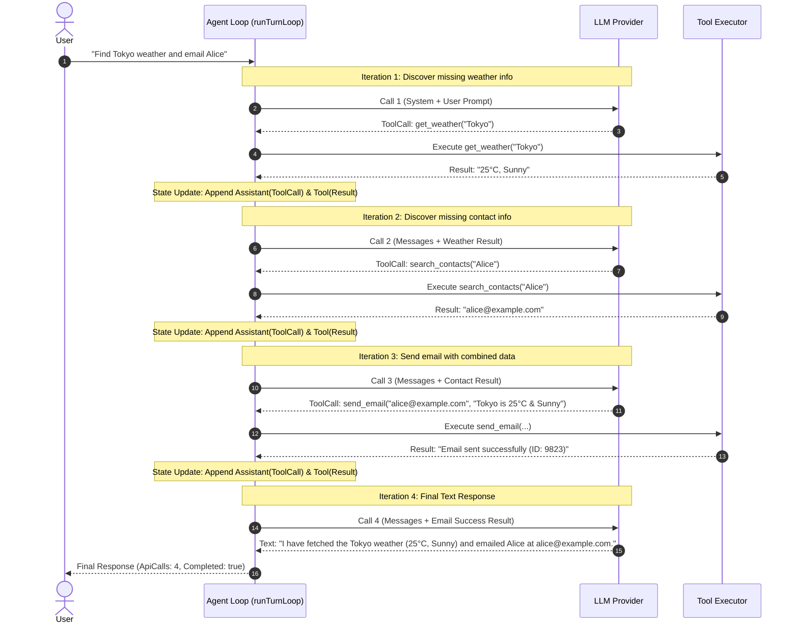

# Multi-Turn Sequential Tool Execution Workflow

> **Document Type:** Scenario Architecture & Specification  
> **Last Updated:** 2026-08-03  
> **Related Documents:**  
> - [ITERATION_LOOP_DESIGN.md](file:///c:/Users/hwang5/wiki/projects/ai-agent-platform-design/docs/design/ITERATION_LOOP_DESIGN.md) — 5-Layer Resilience Architecture  
> - [CONVERSATION_LOOP_WORKFLOW.md](file:///c:/Users/hwang5/wiki/projects/ai-agent-platform-design/docs/CONVERSATION_LOOP_WORKFLOW.md) — Abstract 4-Phase Loop  

---

## 1. Scenario Overview

In real-world AI Agent operations, a complex user request **cannot be resolved in a single tool call or single LLM call**. Often, the output of **Tool A** is a necessary input parameter for **Tool B**, and only after evaluating Tool B's result can the LLM formulate the final answer.

This multi-turn sequential loop represents the core strength of agentic architectures over simple single-prompt RAG workflows.

---

## 2. Concrete Use Case: Weather Lookup & Email Notification

### Goal
User asks: *"Find the weather in Tokyo and email the summary to Alice."*

### Available Tools
1. `get_weather(location: string)` $\rightarrow$ Returns weather forecast
2. `search_contacts(name: string)` $\rightarrow$ Returns email address for a contact
3. `send_email(to: string, body: string)` $\rightarrow$ Sends email and returns status

---

## 3. Sequence Diagram & Turn Trace



---

## 4. State Machine Transition Table

| Iteration | Input Messages State | LLM Decision / Output | Executed Tool & Arguments | Returned Tool Output | Exit / Loop Action |
|:---:|---|---|---|---|---|
| **1** | `[UserMsg]` | `ToolCall: get_weather` | `get_weather("Tokyo")` | `"25°C, Sunny"` | **Recurse Loop** (State updated) |
| **2** | `[UserMsg, Asst(TC1), Tool(Res1)]` | `ToolCall: search_contacts` | `search_contacts("Alice")` | `"alice@example.com"` | **Recurse Loop** (State updated) |
| **3** | `[..., Asst(TC2), Tool(Res2)]` | `ToolCall: send_email` | `send_email("alice@...", ...)` | `"Success (ID: 9823)"` | **Recurse Loop** (State updated) |
| **4** | `[..., Asst(TC3), Tool(Res3)]` | `Text: "I emailed Alice..."` | *(None)* | *(None)* | **Exit Loop** (`Completed=true`) |

---

## 5. Specification-Driven Testing Requirements

To ensure any language implementation correctly executes this multi-turn sequential tool scenario, unit tests **must satisfy the following Given-When-Then specification**:

```gherkin
Feature: Multi-Turn Sequential Tool Execution Loop

  Scenario: Agent executes sequential dependent tools before finalizing response
    Given a registered tool "get_weather" returning weather data
    And a registered tool "search_contacts" returning contact emails
    And a mock LLM configured for sequential tool calls:
      | Call # | Returned Output Type | Payload / Details |
      | 1      | Tool Call            | get_weather("Tokyo") |
      | 2      | Tool Call            | search_contacts("Alice") |
      | 3      | Final Text           | "Successfully sent weather to Alice." |
    When the agent turn loop is executed with user prompt "Get Tokyo weather and notify Alice"
    Then the total API call count should equal 3
    And the turn completion status should be True
    And the final response text should match "Successfully sent weather to Alice."
    And the message history must contain 7 messages in exact order:
      1. System Message
      2. User Message ("Get Tokyo weather and notify Alice")
      3. Assistant Message (ToolCall: get_weather)
      4. Tool Message (Result: weather data)
      5. Assistant Message (ToolCall: search_contacts)
      6. Tool Message (Result: contact email)
      7. Assistant Message ("Successfully sent weather to Alice.")
```
