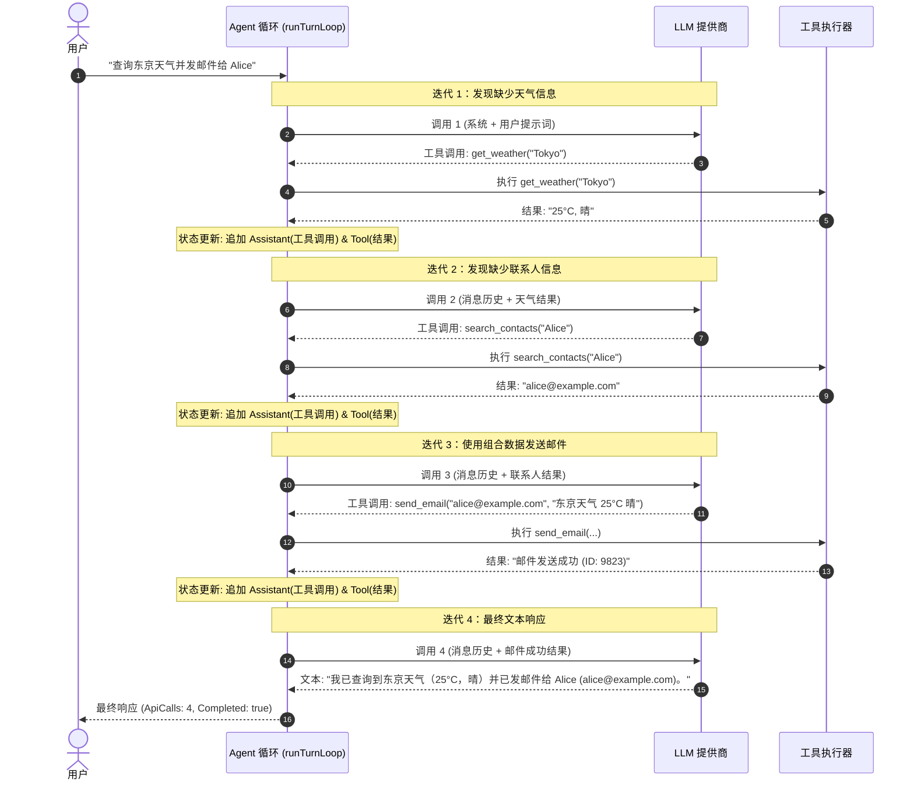

# 多回合顺序工具执行工作流

> **文档类型：** 场景架构与规范说明文档  
> **最后更新日期：** 2026-08-03  
> **相关文档：**  
> - [ITERATION_LOOP_DESIGN.zh.md](file:///c:/Users/hwang5/wiki/projects/ai-agent-platform-design/docs/design/ITERATION_LOOP_DESIGN.zh.md) — 5 层弹性架构  
> - [CONVERSATION_LOOP_WORKFLOW.zh.md](file:///c:/Users/hwang5/wiki/projects/ai-agent-platform-design/docs/CONVERSATION_LOOP_WORKFLOW.zh.md) — 抽象 4 阶段循环规范  

---

## 1. 场景概述

在真实世界的 AI Agent 操作中，一个复杂的用户请求**无法在单次工具调用或单次 LLM 调用中解决**。通常，**工具 A** 的输出是 **工具 B** 的必要输入参数，只有在评估了工具 B 的结果之后，LLM 才能拟定最终答案。

这种多回合顺序循环代表了智能体（Agentic）架构相比简单的单提示词 RAG 工作流的核心优势。

---

## 2. 具体用例：天气查询与邮件通知

### 目标
用户请求：*"查询东京的天气并将摘要发邮件给 Alice。"*

### 可用工具
1. `get_weather(location: string)` $\rightarrow$ 返回天气预报
2. `search_contacts(name: string)` $\rightarrow$ 返回联系人的电子邮件地址
3. `send_email(to: string, body: string)` $\rightarrow$ 发送电子邮件并返回状态

---

## 3. 时序图与回合追踪



---

## 4. 状态机迁移表

| 迭代次数 | 输入消息状态 | LLM 决策 / 输出 | 执行的工具与参数 | 返回的工具输出 | 退出 / 循环动作 |
|:---:|---|---|---|---|---|
| **1** | `[用户消息]` | `工具调用: get_weather` | `get_weather("Tokyo")` | `"25°C, 晴"` | **循环递归**（状态已更新） |
| **2** | `[用户消息, 助手(TC1), 工具(Res1)]` | `工具调用: search_contacts` | `search_contacts("Alice")` | `"alice@example.com"` | **循环递归**（状态已更新） |
| **3** | `[..., 助手(TC2), 工具(Res2)]` | `工具调用: send_email` | `send_email("alice@...", ...)` | `"发送成功 (ID: 9823)"` | **循环递归**（状态已更新） |
| **4** | `[..., 助手(TC3), 工具(Res3)]` | `文本: "已发邮件给 Alice..."` | *(无)* | *(无)* | **退出循环** (`Completed=true`) |

---

## 5. 规范驱动测试要求 (Specification-Driven Testing)

为了确保任何语言实现都能正确执行这种多回合顺序工具场景，单元测试**必须满足以下 Given-When-Then 规范**：

```gherkin
功能 (Feature): 多回合顺序工具执行循环

  场景 (Scenario): Agent 在完成最终响应前顺序执行相互依赖的工具
    假如 (Given) 已注册返回天气数据的工具 "get_weather"
    并且 (And) 已注册返回联系人邮箱的工具 "search_contacts"
    并且 (And) 配置了一个支持顺序工具调用的 Mock LLM：
      | 调用序号 | 返回输出类型 | 载荷 / 详细信息 |
      | 1        | 工具调用     | get_weather("Tokyo") |
      | 2        | 工具调用     | search_contacts("Alice") |
      | 3        | 最终文本     | "成功将天气信息发送给 Alice。" |
    当 (When) 使用用户提示词 "查询东京天气并通知 Alice" 执行 Agent 回合循环
    则 (Then) 总 API 调用次数应等于 3
    并且 (And) 回合完成状态应为 True
    并且 (And) 最终响应文本应匹配 "成功将天气信息发送给 Alice。"
    并且 (And) 消息历史必须精确按顺序包含 7 条消息：
      1. 系统消息 (System Message)
      2. 用户消息 ("查询东京天气并通知 Alice")
      3. 助手消息 (ToolCall: get_weather)
      4. 工具消息 (Result: 天气数据)
      5. 助手消息 (ToolCall: search_contacts)
      6. 工具消息 (Result: 联系人邮箱)
      7. 助手消息 ("成功将天气信息发送给 Alice。")
```
