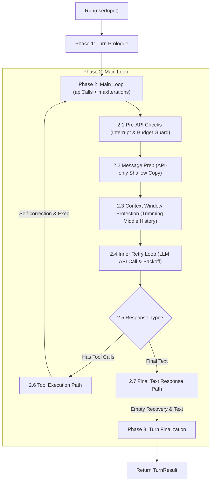

# Ported Conversation Loop Workflow (Multi-Language)

This document describes the ported 4-phase Conversation Loop workflow (inspired by Hermes Agent's `run_conversation` architecture) as implemented across all 4 reference languages: **Python**, **TypeScript**, **C#**, and **Go**.

---

## Architecture Overview

---

## 4-Phase Conversation Loop Pipeline

### Phase 1: Turn Prologue (Per-Turn Initialization)
- Accepts the user input and appends it to canonical `MessageHistory`.
- Resets per-turn runtime state: `apiCalls = 0`, `interruptRequested = false`, `emptyContentRetries = 0`.
- Ensures System Prompt identity is active at `messages[0]`.

### Phase 2: Main Conversation Loop (`while apiCalls < maxIterations`)
1. **2.1 Pre-API Checks**:
   - Check for user interrupt signal. If set, exit turn with `exitReason = "interrupted"`.
   - Check iteration budget (`apiCalls < maxIterations`). If exhausted, exit turn with `exitReason = "budget_exhausted"`.
2. **2.2 Message Preparation (`apiMessages`)**:
   - Create a shallow copy of messages (`apiMessages`) for the LLM request to ensure transient/ephemeral additions do not pollute the canonical message history.
3. **2.3 Context Window Protection**:
   - Check if message count exceeds `contextWindowLimit` (e.g. 30 messages).
   - If exceeded, preserve System Prompt (index 0) and recent messages, summarizing or trimming middle history to prevent payload overflow errors.
4. **2.4 Inner API Retry Loop**:
   - Execute LLM API call with up to `maxRetries` (exponential backoff on transient errors).
5. **2.5 Response Normalization & Validation**:
   - Normalize the response choices, extracting `content` and `tool_calls`.
6. **2.6 Tool Execution Path**:
   - **Unregistered Tool Self-Correction**: If LLM attempts to call an unregistered tool, append a synthetic tool error message listing valid tools so the model can self-correct.
   - **JSON Parse Error Recovery**: If tool arguments fail JSON parsing, append a synthetic tool error message.
   - **Runtime Exception Handling**: Catch tool execution runtime errors and report formatted error strings as tool results.
   - Append assistant message with `tool_calls` and corresponding `tool` result messages to canonical history.
   - `continue` loop to send tool results back to LLM.
7. **2.7 Final Text Response Path**:
   - **Empty Response Recovery**: If LLM output text is empty, retry with a prompt nudge up to 2 times before returning fallback `"(empty response)"`.
   - Append final assistant message to canonical history.

### Phase 3: Turn Finalization & Structured Result Output
Returns a canonical `TurnResult` struct containing:
- `final_response`: The assistant's text response.
- `messages`: Full updated canonical message history.
- `api_calls`: Total LLM calls executed during the turn.
- `completed`: Boolean flag indicating clean completion.
- `failed`: Boolean flag indicating failure.
- `interrupted`: Boolean flag indicating user interruption.
- `exit_reason`: Standardized exit reason string (`"text_response"`, `"budget_exhausted"`, `"api_error"`, `"interrupted"`).
- `error`: Error details if failed.

---

## Language Implementation Mapping

| Language | Implementation File | Key Struct/Class |
|---|---|---|
| **Python** | [implementations/python/agent.py](file:///c:/Users/hwang5/wiki/projects/ai-agent-platform-design/implementations/python/agent.py) | `Agent`, `TurnResult` |
| **TypeScript** | [implementations/typescript/src/Agent.ts](file:///c:/Users/hwang5/wiki/projects/ai-agent-platform-design/implementations/typescript/src/Agent.ts) | `Agent`, `TurnResult` |
| **C#** | [implementations/csharp/Agent.cs](file:///c:/Users/hwang5/wiki/projects/ai-agent-platform-design/implementations/csharp/Agent.cs) | `Agent`, `TurnResult` |
| **Go** | [implementations/go/agent/loop.go](file:///c:/Users/hwang5/wiki/projects/ai-agent-platform-design/implementations/go/agent/loop.go) | `Agent`, `TurnResult` |
